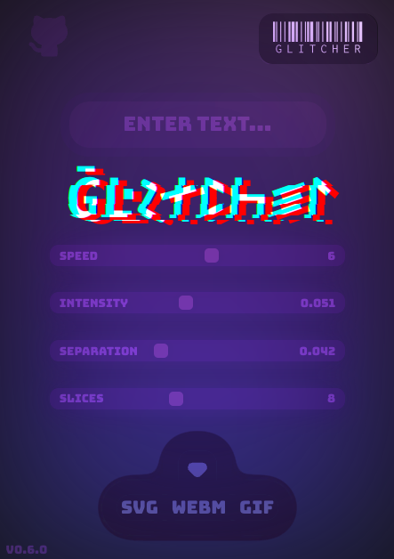

    

        
    

    <h3><kbd>&nbsp;Glitcher&nbsp;App&nbsp;</kbd></h3>
    <h4>
        <a href="https://metaory.github.io/glitcher-app/" target="_blank">
            metaory.github.io/glitcher-app
        </a>
    </h4>
    

        A dynamic SVG glitch effect generator 
         
        with real-time preview and customization
    

    
    
     
    <a href="LICENSE">MIT</a> License
     
    
    
    

